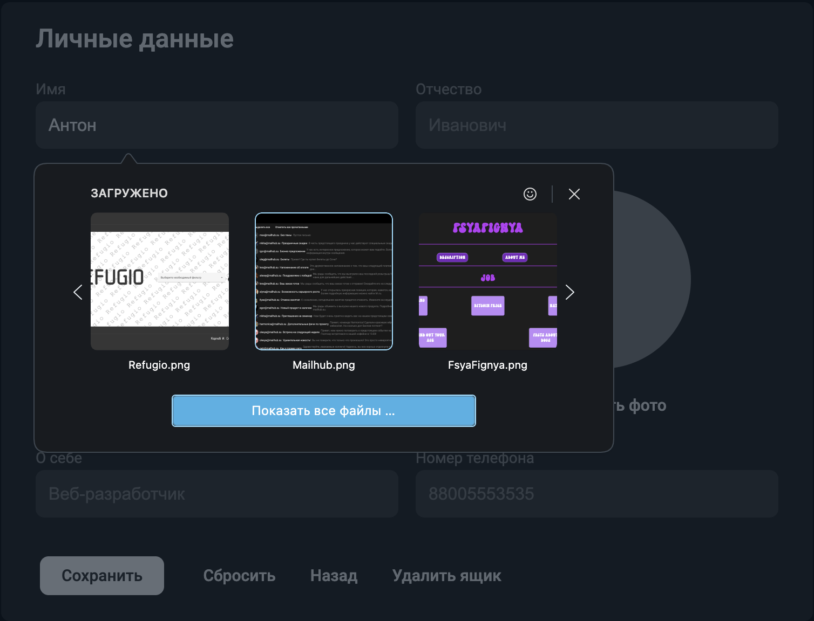

# Домашнее задание 1 по курсу QA команды MailHub

## Тестируемые части:
1. Боковое меню
2. Меню редактирования папок
3. Редактирование наличия письма в папке
4. Профиль
5. Страница списка писем
6. Страница письма
7. Блок Профиль
8. Страница написания и редактирования письма

# Боковое меню

## Общее

* Боковое меню присутствует на любой странице
* Боковое меню присутствует на странице в развернутом виде, если открыта Desktop версия сайта
* Чтобы открыть боковое меню на Mobile версии необходимо нажать на кнопку "Общего меню"
* В боковом меню присутствуют кнопки "Написать письмо" и "Новая папка"
* В боковом меню присутствуют 4 кнопки для "основных" неизменяемых папок: "Входящие", "Отправленные", "Черновики", "Спам"
* Если у пользователя есть созданные папки, они отображаются под основными
* Для переключения на другую папку в боковом меню можно нажать на соответствующую папку

## Кнопка "Написать письмо"

* Нажатие перенаправляет на страницу создания письма: https://mailhub.su/write_letter

## Кнопки для "основных" папок

* При нажатии на кнопку "Входящие" происходит перенаправление на список входящих писем: https://mailhub.su/main
* При нажатии на кнопку "Отправленные" происходит перенаправление на список отправленных писем: https://mailhub.su/sent
* При нажатии на кнопку "Черновики" происходит перенаправление на список черновиков: https://mailhub.su/drafts
* При нажатии на кнопку "Спам" происходит перенаправление на список писем находящихся в спаме: https://mailhub.su/spam

## Кнопки для созданных папок

* При нажатии на кнопку "My Folder" происходит перенаправление на список писем находящихся в этой папке
* При нажатии на Meatball menu выпадает форма для редактирования данной папки

## Кнопка "Новая папка"

* При нажатии выпадает форма для создания новой папки

# Форма для создания новой папки

* Форма имеет две кнопки: "Сохранить" и "Отмена"
* При вводе небольшого количества символов в названии папки надпись корректно отображается
* При достаточно длинном названии папки часть названия скрывается
* Если длина названия больше 30 символов, то появляется появляется сообщение "Слишком длинное название"
* Баг - при пустом вводе поле подсвечивается красным цветом и выводится ошибка "Введите имя", а должно быть "Введите название".

## Кнопка "Сохранить"

* При нажатии на кнопку "Сохранить" происходит создание папки, при этом пользователь остаётся на той же странице, на которой был
* Можно создать две папки с одинаковым названием

## Кнопка "Отмена"

* При нажатии на кнопку "Отмена" происходит сброс создания папки

# Меню редактирования папок

## Общее

* Meatball menu есть только у созданных папок
* При вводе небольшого количества символов в названии папки надпись корректно отображается
* При достаточно длинном названии папки часть названия скрывается
* Если длина названия больше 30 символов, то появляется появляется сообщение "Слишком длинное название"

## Кнопка "Сохранить"

* При нажатии на кнопку "Сохранить" происходит обновление названия папки, при этом пользователь остаётся на той же странице, на которой был
* Баг - если стереть название папки, то в поле появится пример названия: "ivanovii@mailhub.su". Это пример название почтового ящика как при авторизации, но не названия папки.
* Баг - если поле названия папки пустое, то при нажатии на кнопку "Сохранить" поле подсвечивается красным цветом и выводится ошибка "Введите имя", а должно быть "Введите название".

## Кнопка "Отмена"

* При нажатии на кнопку "Отмена" происходит сброс изменений

## Кнопка "Удалить"

* При нажатии на кнопку "Удалить" происходит удаление папки, при этом пользователь остаётся на той же странице, на которой был

# Редактирование наличия письма в папке

## Кнопка "В папку"

* При нажатии на кнопку выпадает список созданных папок
* При выборе папки, в которую хотят положить письмо пользователя перенаправляет на страницу со списком данной папки
* Если папок нет или письмо уже находится в единственно созданной папке, то выпадает надпись "Нет папок!"

## Кнопка "Убрать из папки"

* При нажатии на кнопку выпадает список папок, в которых находится письмо
* При выборе папки, из которой хотят удалить письмо пользователя перенаправляет на страницу данной папки
* Если письмо не находится ни в одной из созданных папок, то выпадает надпись "Нет папок!"

# [Профиль](https://mailhub.su/profile)

## Изменение данных о пользователе ([вкладка "Профиль"](https://mailhub.su/profile))

* В случае если хотя бы одно из полей "Фамилия" и "Имя" пустое выдается ошибка "Введите фамилию" или "Введите имя" соответственно. Поле "Отчество", "О себе", "Номер телефона" могут быть пустыми.

* В случае если поля "Фамилия" и "Имя" и "Отчество" не пустые, но содержат что-либо кроме букв латиницы, кириллицы выдается ошибка "Некорректная фамилия" или "Некорректное имя" или "Некорректное отчество" соответственно.

* В случае если поле "Номер телефона" не пустое, но содержат что-либо кроме цифр выдается ошибка "Некорректный номер".

* В случае если поле "О себе" не пустое, то может содержать любые символы.

* Ошибка выводится под полем, в котором ошибка в формате "Некорректная [название поля]" или "Некорректное [название поля]" или "Некорректный [название поля]".

* При нажатии на кнопку "Назад" происходит переход на [вкладку "Входящие"](https://mailhub.su/main)

* При нажатии на кнопку "Сбросить" все поля становятся пустыми.

* При нажатии на кнопку "Сохранить" происходит замена текста в кнопке на "Успешно сохранено", данные сохраняются или указываются ошибки.

* При нажатии на кнопку "Удалить ящик" всплывает плашка "Вы уверены, что хотите удалить ящик?", чтобы пользователь подтвердил действие. Если пользователь подтверждает, то удаляется профиль пользователя и происходит переход на [вкладку "Вход"](https://mailhub.su/login)

## Изменение аватарки пользователя (нажатие по аватарке/плейсхолдеру)

* При нажатии на аватарку/плейсхолдер отображается окно изменения аватара

## Окно изменения аватара

* При нажатии на кнопку "Установить фото" отображается системное окно выбора файла изображения с поддерживаемыми типами (`.jpg`, `.jpeg`, `.jfif`, `.pjpeg`, `.pjp`, ``.png`).

* При сохранении изображения с поддерживаемыми типами (`.jpg`, `.jpeg`, `.jfif`, `.pjpeg`, `.pjp`, ``.png`) и весом более 5МБ аватар не обновляется, под аватаром отображается предупреждение о том, что размер "Проблема на нашей стороне. Уже исправляем"

# Страница списка писем

## Список писем

### Общее

* Содержит письма, входящие в одну из следующих категорий: Входящие, Отправленные, Черновики, Спам, письма из папок
* Информация, которую можно узнать о письмах в списке писем: статус прочтения, отправитель, аватар отправителя, тема, текст, дата отправления. В случае отображения списка отправленных, отправитель и аватар отправителя меняются на получателя и аватар получателя соответсвенно
* Отправитель, тема, текст у писем из списка писем могут отображаться не полностью
* Список Входящих отображается на главной странице
* Через список писем можно выбрать нужное письмо и выполнить с ним следующие действия: открыть письмо, отметить прочитанных/непрочитанным, выбрать
* Одинаковый функционал веб и тач версии списка писем
* Список писем загружается и рендерится полностью, независимо от количества писем в нем

### Контейнер "Письмо"

* Нажатие вне кнопок "Отметить прочитанным/непрочитанным", "Выбрать письмо" открывает письмо, т.е. происходит перенаправление на https://mailhub.su/letter?id={letter_id}

### Кнопка "Отметить прочитанным/непрочитанным"

* Нажатие меняет статус прочтения (с прочитанного на непрочитанный и обратно) для выбранных писем

### Кнопка "Выбрать письмо"

* Нажатие меняет отображение статуса выбора (с выбранного и невыбранное и обратно) и добавляет письмо в массив выбранных писем

## Тулбар по работе с письмами

### Общее

* Содержит некоторые из кнопок: Выделить все/Снять выделение, Отметить все прочитанными/Пометить прочитанными/Пометить непрочитанными, Удалить, В папку, Убрать из папки, Спам/Из спама
* Позволяет производить манипуляции с выбранными письмами
* Позволяет производить манипуляции со всеми письмами из списка
* Одинаковый функционал веб и тач версии списка писем

### Кнопка "Выделить все/Снять выделение"

* Отображается на любой странице, содержащей список писем
* Содержит счетчик выбранных писем
* Содержит иконку, показывающую, есть ли на данный момент выбранные письма
* Добавляет все письма из списка в массив выбранных/очищает массив выбранных писем

### Кнопка "Отметить все прочитанными/Пометить прочитанными/Пометить непрочитанными"

*  Отображается на любой странице, содержащей список писем
*  Нажатие меняет статус прочтения (с прочитанного на непрочитанный и обратно) у всех писем для "Отметить все прочитанными" и у выбранных писем для "Пометить прочитанными"/"Пометить непрочитанными"

### Кнопка "Удалить"

* Отображается при наличии выбранных писем
* Нажатие убирает выбранные письма из списка писем, с последующими изменениями интерфейса (меняется счетчик писем, перерендер тулбара)

### Кнопка "В папку"

* Отображается при наличии выбранных писем
* Нажатие отображает список доступных папок
* Последующий выбор папки выполняет редирект на https://mailhub.su/folder?{folder_id}

### Кнопка "Убрать из папки"

* Отображается при наличии выбранных писем и нахождении на странице папки
* Нажатие убирает письмо из списка писем в папке

### Кнопка "Спам/Из спама"

* Отображается при наличии выбранных писем
* Нажатие убирает письмо из текущего списка писем

# Страница письма

## Контейнер "Письмо"

### Общее

* В контейнере письма отображается вся доступна пользователю информация о письме: статус прочтения, отправитель, аватар отправителя, тема, текст, дата отправления, вложения. В случае отображения списка отправленных, отправитель и аватар отправителя меняются на получателя и аватар получателя соответсвенно
* Через контейнер письма можно выполнить с письмом следующие действия: отметить прочитанным/непрочитанным, посмотреть вложения, скачать вложения, скачать все вложения
* Одинаковый функционал веб и тач версии списка писем

### Кнопка "Отметить прочитанным/непрочитанным"

* Нажатие меняет статус прочтения (с прочитанного на непрочитанный и обратно)

### Кнопка "Посмотреть вложения"

* Нажатие открывает список вложений

### Кнопка "Скачать вложения"

* Нажатие скачивает выбранное вложение

### Кнопка "Скачать все"

* Нажатие скачивает все вложения

## Тулбар по работе с письмом

### Общее

* Содержит некоторые кнопки: Назад, Удалить, В папку,  Убрать из папки, Спам/Из спама, Пометить прочитанным/непрочитанным, Ответить, Переслать
* Позволяет производить манипуляции с письмом
* Одинаковый функционал веб и тач версии списка писем

### Кнопка "Назад"

* Нажатие выполняет редирект предыдущую страницу в истории, если такая есть, в противном случае редиректа не происходит

### Кнопка "Удалить"

* Нажатие выполняет редирект на https://mailhub.su/main

### Кнопка "В папку"

* При нажатии на кнопку выпадает список созданных папок
* При выборе папки, в которую хотят положить письмо пользователя перенаправляет на страницу со списком данной папки
* Если папок нет или письмо уже находится в единственно созданной папке, то выпадает надпись "Нет папок!"

### Кнопка "Убрать из папки"

* Нажатие отображает список папок, в которых содержится письмо
* Нажатие выполняет редирект на https://mailhub.su/folder?{folder_id}

### Кнопка "Спам/Из спама"

* Нажатие выполняет редирект на https://mailhub.su/main
  
### Кнопка "Пометить прочитанным/непрочитанным"

*  Нажатие меняет статус прочтения (с прочитанного на непрочитанный и обратно)

### Кнопка "Ответить"

* Нажатие выполняет редирект на https://mailhub.su/write-letter с заготовленным шаблоном письма

### Кнопка "Переслать"

* Нажатие выполняет редирект на https://mailhub.su/write-letter с заготовленным шаблоном письма

# Блок "Профиль"

### Общее

* Содержит аватар пользователя
* Содержит кнопки Личные данные, Выйти, информацию об адресе электронной почты польователя, аватар пользователя
* Одинаковый функционал веб и тач версии списка писем

### Кнопка "Личные данные"

* Нажатие выполняет редирект на https://mailhub.su/profile

### Кнопка "Выход"

* Нажатие выполняет редирект https://mailhub.su/login

# [Страница написания и редактирования письма](https://mailhub.su/write_letter)

## Написание письма ([вкладка "Страница написания и редактирования письма"](https://mailhub.su/write_letter))

* В случае, если поле "Кому" пустое, выдается ошибка "Введите получателя". Поле "Тема" и "Текст письма" могут быть пустыми.

* В случае, если поле "Кому" не содержит символ '@', выдается ошибка "Забыли @".

* В случае, если поле "Кому" не содержит символ '.', выдается ошибка "Забыли .".

* В случае, если поле "Кому" содержит что либо кроме латинских букв, цифр и сиволов '_','.','+','-','%' в левой части адреса, то выдается ошибка "Некорректное имя ящика получателя".

* В случае, если поле "Кому" имеет длину, большую 64 символов, выдается ошибка "Слишком длинное имя ящика получателя".

* В случае, если поле "Тема" имеет длину, большую 64 символов, выдается ошибка "Слишком длинная тема".

* В случае если поля "Тема" и "Текст письма" не пустые, то они могут содержать любые символы.

* Ошибка выводится под полем в формате "Некорректная [название поля]" или "Некорректное [название поля]" или "Некорректный [название поля]".

* При нажатии на кнопку "Отменить" происходит переход на предыдущую вкладку в истории браузера.

* При нажатии на кнопку "Сохранить черновик" письмо со всеми полями и файлами сохраняется как черновик и происходит переход на переход на [вкладку "Входящие"](https://mailhub.su/main)

* При нажатии на кнопку "Отправить" письмо со всеми полями и файлами сохраняется, отправляется на указанный адрес и происходит переход на [вкладку "Входящие"](https://mailhub.su/main) или указываются ошибки.

* В случае, если поле "Тема" или поле "Текст письма" остаются пустыми, то после успешной отправки они заменяются на "Без темы" или "Пустое письмо" соответственно.

## Прикрепление файла к письму

* При нажатии на кнопку "Прикрепить файл" отображается системное окно выбора файла.

* При сохранении файла весом более 20МБ файл не прикрепляется, под кнопкой отображается ошибка "Файл превышает максимальный размер 20 МБ".

* При успешном добавлении файла появляется кнопка "[количество файлов] файла", при нажатии на которую открывается список со всеми файлами, их размером и кнопкой "Удалить".

* При нажатии на кнопку "Удалить" выбранный файл удаляется из письма.

* При нажатии на кнопку "Удалить всё" все файлы удаляются из письма.
